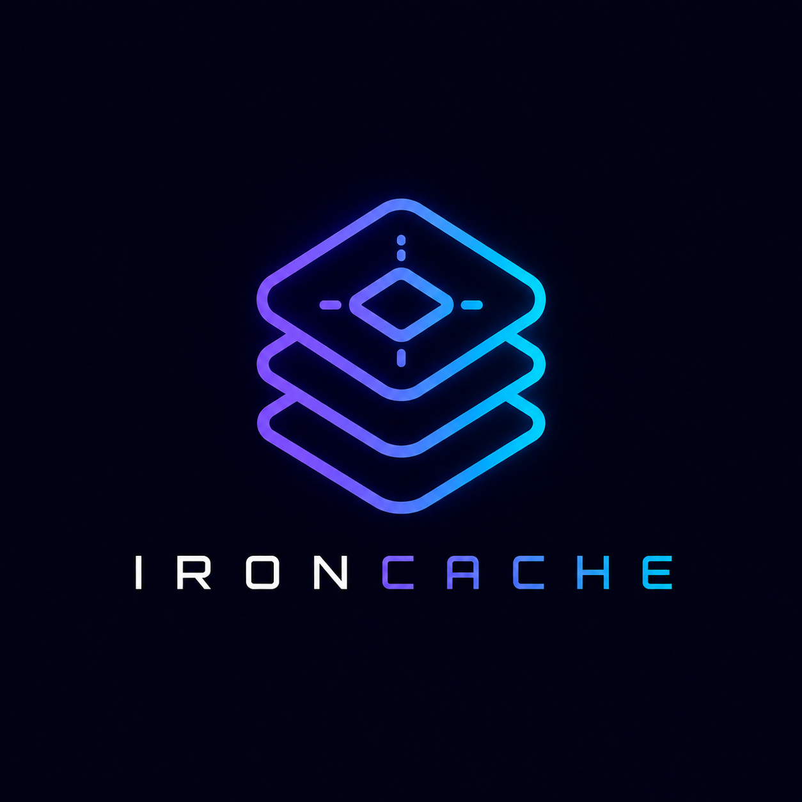

<p align="center">
  
</p>

# IronCache

**The most efficient Redis-compatible cache, in one static Rust binary.**

> Status: the engine is FUNCTIONAL and under active, measured optimization. IronCache
> speaks RESP2 and RESP3 with 150+ commands across all core types (strings, lists,
> hashes, sets, sorted sets, bitmaps, HyperLogLog), plus transactions, pub/sub, and a
> cross-shard coordinator, backed by 800+ tests. A reproducible head-to-head (see
> [Benchmarks](#benchmarks-how-it-compares)) shows it PARITY-OR-BETTER on memory and
> FASTER per core than Redis 8.8.0, Valkey 8.1.8, KeyDB, DragonflyDB 1.39.0, and
> Memcached on a pinned-core Linux runner. Persistence and clustering remain on the
> [roadmap](docs/ROADMAP.md). The design record lives in the
> [GitHub issues](https://github.com/ELares/IronCache/issues) (start at the
> [vision EPIC (#1)](https://github.com/ELares/IronCache/issues/1)), the
> [prior-art survey](docs/PRIOR_ART.md), and the [research corpus](docs/research/).

IronCache is a cache that speaks the Redis wire protocol, keeps the Redis
contract for the commands it supports, and is built from the first commit to be
the most efficient cache in the world: maximal throughput per core, minimal
memory per item, smart compression, and a clean path from a single node to a
cluster. It ships as one static binary that is both the server and the CLI. It
takes the best ideas from Redis, Valkey, KeyDB, DragonflyDB, Memcached, and
Garnet, and from the academic caching literature, and leaves behind the
single-threaded command core, the fork-based memory spikes, and the managed
runtimes that hold the incumbents back.

This project is also an experiment in method: it uses AI to mine the world's
prior art, propose new approaches, and adversarially verify every load-bearing
claim before trusting it. The [research corpus](docs/research/) and the
version-pinned [`claims.yaml`](docs/prior-art/claims.yaml) are the output of
that process.

---

## Why IronCache exists

Every existing cache is wrong for "the most efficient Redis-compatible cache" in
a different way, and each wrongness maps to one of our tenets.

- **Redis (OSS)** executes every command on a single thread. Even with
  `io-threads`, the I/O threads only read, parse, and write sockets; the keyspace
  is still mutated by one thread, so most of a modern CPU sits idle. Its
  fork-based `BGSAVE` can use up to about twice the resident memory under write
  load, it ships no transparent value compression, and in 2024 its core was
  relicensed away from open source. That fails **Efficient**.
- **Valkey** is the open (BSD-3) Linux Foundation fork of Redis, and its
  asynchronous I/O threading is a real step up in throughput. But it is an
  evolution of the Redis core, not a rethink: command execution and the data
  structures are inherited, so the ceiling is the inherited architecture, not a
  shared-nothing one. Closer on **Efficient**, still bounded by it.
- **KeyDB** multi-threads the shared keyspace behind locks and reports several
  times Redis's throughput, but a mutated keyspace under spinlocks has a
  contention ceiling, and the project has been effectively dormant since 2024.
  That fails **Efficient** at the top end, and bets on an unmaintained base.
- **DragonflyDB** is the state of the art for vertical efficiency: shared-nothing
  thread-per-core over io_uring, an extendible-hashing Dashtable with far less
  per-item metadata than the Redis dict, and a forkless point-in-time snapshot
  with constant memory overhead. We borrow that architecture wholesale. But its
  headline wins are vertical scaling plus metadata reduction, not raw single-core
  speed (on one core it is roughly at parity with Redis), its cluster mode began
  as single-process emulation, and it is a C++ and Boost.Fibers stack. IronCache
  targets per-core speed and a real multi-node design on top of the same shape.
- **Memcached** is multi-threaded from the start, with a slab allocator and a
  scan-resistant segmented LRU worth studying. But it does not speak the Redis
  contract, has no rich data types, no persistence, and no server-side
  clustering. That fails **Compatible** and **Scalable**.
- **Garnet** is RESP-compatible, scales well across cores, and has an excellent
  log-structured store underneath. But it is a .NET and C# product with a managed
  runtime and a garbage collector, not a single static binary you drop onto a box
  with a kernel-only dependency. That fails **Simple**.

None of them is a single static binary that keeps the Redis contract, scales
across every core with a shared-nothing core, is frugal with memory, and grows
from one node to many. IronCache exists to be exactly that intersection.

---

## Benchmarks: how it compares

IronCache is built to be measured, not asserted. The numbers below are a reproducible
head-to-head ([`scripts/bench/headtohead.sh`](scripts/bench/headtohead.sh), run via the
`headtohead` GitHub Actions workflow) against every cache this project benchmarks
against, on identical hardware.

**Setup.** GitHub-hosted `ubuntu-latest` (a shared 4-vCPU VM). The server and the load
generator are pinned to DISJOINT cores with `taskset` (server on cores 0-1, client on
cores 2-3) so they never contend for a core. Workload: a YCSB-style Zipfian (theta 0.99)
mix, 90% GET / 10% SET, 1,000,000 distinct keys, 128-byte values. IronCache runs 2
shards (one per pinned core). Each competitor is installed at the leanest version that
installs on the runner (the latest memory-optimized line where it matters).

- **Memory** is the `INFO used_memory` delta over a deterministic 1M-key populate,
  divided by the key count (bytes per key). It is deterministic and reliable on any box,
  and is the metric we ratchet hardest.
- **Throughput** is closed-loop peak QPS divided by the 2 pinned server cores (QPS per
  core).
- **Latency** is an open-loop, coordinated-omission-free p50/p99 at a 50k ops/s target.

| Competitor (measured version) | Memory IC / comp B/key | Throughput IC / comp QPS/core | p50 us (IC / comp) | p99 us (IC / comp) |
| --- | --- | --- | --- | --- |
| **Redis 8.8.0** (kvobj) | **180.3 / 206.2 = 0.87x** (IC 13% lighter) | **72,903 / 47,809 = 1.52x** | 8,175 / 7,907 | 63,679 / 52,735 |
| **Valkey 8.1.8** (embedded key) | **180.3 / 209.6 = 0.86x** (IC 14% lighter) | **74,115 / 45,939 = 1.61x** | 8,199 / 8,131 | **53,471 / 150,911** |
| **DragonflyDB 1.39.0** | 180.3 / 178.6 = 1.01x (parity) | **72,564 / 71,549 = 1.01x** | **8,119 / 10,607** | **94,015 / 108,415** |
| **KeyDB 6.3.4** | **180.3 / 240.4 = 0.75x** (IC 25% lighter) | **72,514 / 59,474 = 1.22x** | 9,231 / 5,951 | 77,439 / 25,295 |
| **Memcached 1.6.24** | **180.3 / 194.9 = 0.93x** (IC 7% lighter) | n/a (non-RESP) | n/a | n/a |

A memory ratio below 1.0 means IronCache stores the same data in fewer bytes per key; a
throughput ratio above 1.0 means it does more work per core. **IronCache is
parity-or-better on memory against all five, and faster per core than every
Redis-protocol competitor.** It is roughly tied with DragonflyDB (the vertical-efficiency
state of the art) on both axes, and beats Redis, Valkey, and KeyDB on both. Even against
the latest memory-optimized Redis (the 8.2+ kvobj) and Valkey (the 8.0 embedded key +
8.1 hashtable redesign), the 8-byte tagged-pointer slot and the single-allocation
key+value+TTL blob keep IronCache lighter.

**Honesty notes.** A GitHub-hosted shared 4-vCPU VM is INDICATIVE, not publishable; the
authoritative verdict needs dedicated bare metal. Memory (bytes per key) is deterministic
and the most trustworthy figure; QPS, and especially p99 latency, carry meaningful
runner-to-runner variance (the p99 column is noisy on a shared box, which is why it goes
both ways). Memcached does not speak the Redis wire protocol, so only its memory is
compared (populated over the memcached text protocol, read from its own `stats`); a
throughput comparison would be cross-protocol and is out of scope. Memory is value-size
and key-count sensitive (both engines' hash tables have fill-state effects), so the win
margin moves with the workload; the full sweep and the round-by-round optimization
history are in [docs/bench/OPTIMIZATION_LOG.md](docs/bench/OPTIMIZATION_LOG.md), and the
version-pinned competitor matrix is in
[docs/bench/COMPETITORS.md](docs/bench/COMPETITORS.md). Reproduce any row with
`gh workflow run headtohead.yml -f competitor=<redis|valkey|dragonfly|keydb|memcached>`.

---

## The five tenets

We rank the tenets, and when two conflict we resolve in this order:
**Compatible > Efficient > Simple > Scalable > AI-Driven.**

| Tenet | What it means in practice |
| --- | --- |
| **Compatible** | IronCache speaks RESP2 and RESP3 and honors the observable Redis contract for every command it claims to support, so existing Redis clients, libraries, and `redis-cli` work unchanged against the supported surface. Compatibility is tiered and explicit: a command is either supported with Redis-identical semantics, or it is documented as unsupported. We never bend the wire protocol or a command's observable behavior to win a benchmark. |
| **Efficient** | The reason to exist. Maximal throughput per core via a shared-nothing, thread-per-core architecture with no hot-path locks, the lowest-overhead I/O path available (io_uring with a portable fallback), compact in-memory encodings, optional transparent value compression, and a modern eviction policy. Efficiency is measured honestly: per-core throughput, tail latency (p99 and p999), and memory at a fixed hit ratio, not just a headline ops-per-second number at maximum pipelining. |
| **Simple** | One static binary that is both the server and the CLI, one config file with safe defaults, install to first `GET` in under a minute, and a self-update path with rollback. No JVM, no .NET, no external dependencies, kernel-only at runtime. The single binary can introspect and operate itself. |
| **Scalable** | Vertical first: one process uses every core. Then horizontal: a clean path from a single node to a multi-node cluster that keeps the client contract, designed from the architecture spec rather than bolted on. |
| **AI-Driven** | The project uses AI to analyze prior art, propose and benchmark new approaches, and adversarially verify claims before trusting them (this repository is the proof). In the engine, learned and adaptive policies (eviction, admission, autotuning) are allowed only off the hot path and only when they never compromise the contract, determinism, or tail latency. |

---

## What IronCache is, and is not

**IronCache v1 IS:**

- A single static Rust binary that speaks RESP2 and RESP3 and keeps the Redis
  contract for a defined, documented command surface.
- A shared-nothing, thread-per-core engine: the keyspace is sharded so each
  shard is owned and mutated by exactly one core, eliminating hot-path locks and
  using every core in the box.
- Memory-frugal: compact encodings and a low-metadata hash table (an 8-byte
  tagged-pointer slot over a single-allocation key+value+TTL blob), with optional
  transparent compression for large or cold values. Measured (see
  [Benchmarks](#benchmarks-how-it-compares)): lighter per key than Redis, Valkey, KeyDB,
  and Memcached, and at parity with Dragonfly, on the 128-byte head-to-head.
- Smart about eviction: a modern, concurrency-friendly policy (the
  TinyLFU, S3-FIFO, and SIEVE family) chosen by measured hit ratio per byte,
  not a legacy approximated LRU.
- Persistable without a fork: a point-in-time snapshot with bounded, constant
  extra memory, so saving never doubles the resident set.
- Single-node first, with a real multi-node cluster design on the roadmap.
- Both the server and the CLI in one binary, with a one-command install and a
  safe self-update.

**IronCache v1 is explicitly NOT (committed non-goals):**

- Not a 100 percent drop-in for every Redis command and every Redis module on
  day one. Compatibility is tiered, and the unsupported surface is documented,
  not silently wrong.
- Not a durable system of record or a primary database. IronCache is a cache.
  Durability options exist, but the contract is a cache contract, not an ACID
  database contract.
- Not an exactly-once, strongly-consistent distributed database. Multi-node
  consistency is a deliberate, documented trade-off, resolved in its design
  issue, not an unbounded promise.
- Not a managed runtime. No JVM, no .NET, no garbage collector in the hot path.
- Not willing to break the wire protocol or a command's observable semantics to
  improve a benchmark. Compatible outranks Efficient.
- Not running AI inference on the hot path. Learned policies advise the engine
  off the critical path; they never sit between a client and its reply.

These non-goals are traceable to a tenet or to a deferred milestone, and each is
recorded in its own `non-goal` issue.

---

## Prior art

IronCache is built on a deep, version-pinned reading of the field. The full
survey is in [docs/PRIOR_ART.md](docs/PRIOR_ART.md), every numeric claim is
pinned in [docs/prior-art/claims.yaml](docs/prior-art/claims.yaml), and the
per-dimension research lives in [docs/research/](docs/research/). In short:

- **Architecture** comes from DragonflyDB: shared-nothing thread-per-core over
  io_uring, with Rust ownership making the "one core owns one shard" rule a
  compile-time guarantee rather than a convention.
- **Memory** comes from Dragonfly's Dashtable (extendible hashing, far less
  per-item metadata than the Redis dict) and from Memcached's slab discipline,
  pushed further with compact encodings and optional compression.
- **Eviction** comes from the modern literature: W-TinyLFU (Caffeine), S3-FIFO,
  and SIEVE, which beat approximated LRU on hit ratio and are far friendlier to a
  lock-light, per-core design.
- **Persistence** comes from Dragonfly's forkless versioned snapshot and from
  the FASTER and Tsavorite hybrid-log lineage behind Garnet.
- **The contract** comes from Redis and Valkey: RESP2, RESP3, and the observable
  semantics of the supported commands.
- **Operability** comes from the single-binary, self-updating tradition, with
  the server and CLI in one artifact.

---

## Quick start (planned, illustrative only)

The CLI surface is being designed in its own issue and is not final. The intended
experience:

```sh
# install (one static binary, server and CLI in one)
curl --proto '=https' --tlsv1.2 -LsSf https://ironcache.dev/install.sh | sh

# run with safe defaults: every core, sensible memory limit, snapshot on
ironcache serve

# talk to it with any Redis client, including redis-cli
redis-cli -p 6379 SET hello world
redis-cli -p 6379 GET hello

# or the built-in CLI
ironcache cli GET hello

# update in place, with rollback if the new version fails to come up
ironcache upgrade
```

---

## Building

The engine is functional: a shared-nothing, thread-per-core server speaking RESP2/RESP3
with 150+ commands across all core types (strings, lists, hashes, sets, sorted sets,
bitmaps, HyperLogLog), transactions (MULTI/EXEC/WATCH), pub/sub, AUTH, a maxmemory
ceiling with eviction, and a cross-shard coordinator. To build and run from source you
need a stable Rust toolchain (MSRV 1.85, edition 2024):

```sh
cargo build --workspace
cargo test --workspace          # 800+ tests

# boot the server on every core (sharded, thread-per-core) and talk to it with any
# Redis client; GET/SET/DEL, the collection types, TTLs, and the maxmemory ceiling work
cargo run -p ironcache -- server
redis-cli -p 6379 SET hello world   # -> OK
redis-cli -p 6379 GET hello         # -> "world"

# other modes: print the effective config, or run a config self-check
cargo run -p ironcache -- config
cargo run -p ironcache -- check
```

Persistence (a forkless snapshot) and the multi-node cluster are the remaining v1
milestones; see [docs/ROADMAP.md](docs/ROADMAP.md) for the slice order, and
[docs/bench/OPTIMIZATION_LOG.md](docs/bench/OPTIMIZATION_LOG.md) for the efficiency
campaign that produced the [Benchmarks](#benchmarks-how-it-compares) above.

---

## How this repository is organized

- [README.md](README.md): the canonical vision, tenets, and committed non-goals.
- [docs/PRIOR_ART.md](docs/PRIOR_ART.md): the version-pinned comparative survey.
- [docs/prior-art/claims.yaml](docs/prior-art/claims.yaml): the single source of
  truth for every numeric or version-specific prior-art claim, with sources,
  pinned versions, confidence, and an independent verification verdict.
- [docs/research/](docs/research/): the per-dimension research corpus and the
  machine-readable [`corpus.json`](docs/research/corpus.json).
- The [GitHub issues](https://github.com/ELares/IronCache/issues): the
  authoritative design record, grouped by milestone, indexed from the
  [vision EPIC (#1)](https://github.com/ELares/IronCache/issues/1).

## Contributing

IronCache is documentation-first and currently in its research phase. The best
way to help today is to challenge a prior-art claim, add a source, or sharpen a
design decision on its issue. See [CONTRIBUTING.md](CONTRIBUTING.md) and
[GOVERNANCE.md](GOVERNANCE.md). Prose in this project uses no em dashes or en
dashes.

## License

Dual-licensed under your choice of [MIT](LICENSE-MIT) or
[Apache-2.0](LICENSE-APACHE). Copyright is held collectively by
"The IronCache Authors".
